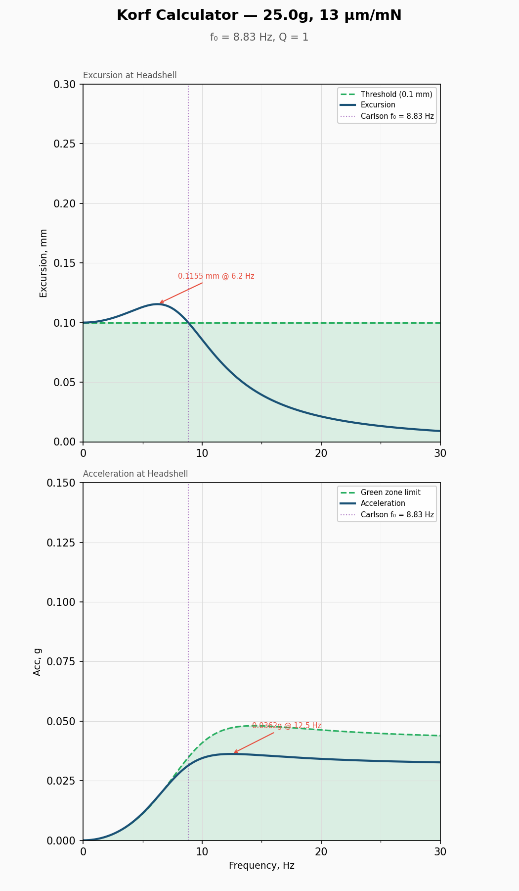
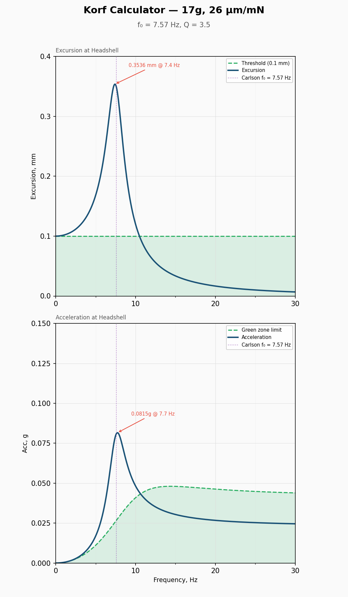
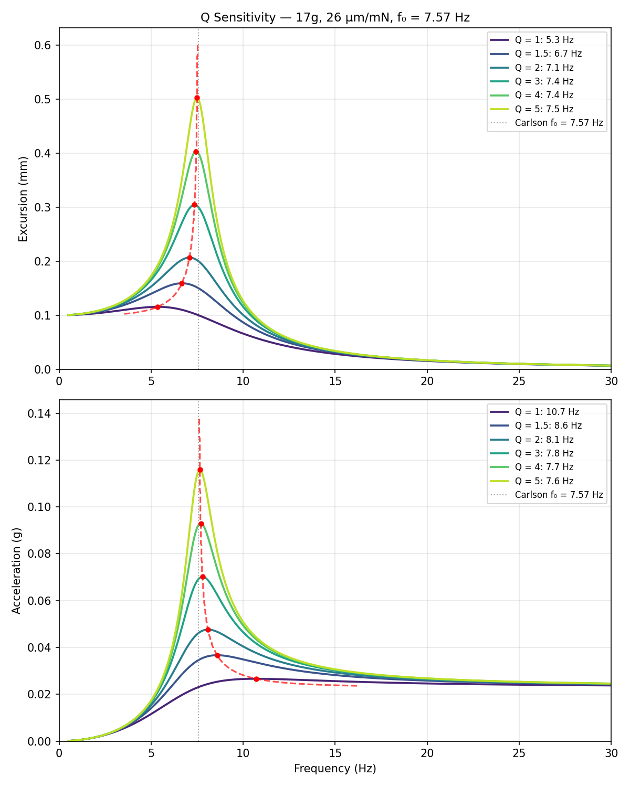

# Korf Audio Compliance/Effective Mass Calculator — v0.1.1

Python implementation of the cartridge compliance calculator from [korfaudio.com/calculator](https://korfaudio.com/calculator), reverse-engineered by JP / sjplot.com with Claude analysis (Feb 2026).

## What it does

Computes and plots the frequency response of a phono cartridge/tonearm system: headshell excursion (mm) and acceleration (g) as a function of frequency, given the tonearm effective mass and cartridge compliance. A green zone reference curve shows the Korf-recommended acceleration boundary.

## Physics

The model treats the tonearm + cartridge as a single-degree-of-freedom damped harmonic oscillator.

**Carlson natural frequency** — derived from Hooke's law for a mass on a spring, where the cartridge compliance acts as the spring constant:

    f₀ = 159.15 / √(m × C)

where m is total effective mass (grams) and C is compliance (µm/mN).

**Valencia-Campo transfer function** — the textbook driven damped harmonic oscillator displacement transmissibility:

    H(f) = 1 / √((1 − r²)² + (r/Q)²)

where r = f/f₀ and Q is the quality factor (default 1.0, user-adjustable).

Headshell excursion is the input displacement (0.1 mm) multiplied by H(f). Acceleration is derived from excursion via ω²×displacement, converted to g.

## Example output



This implementation allows Q to be specified as an input parameter so that more realistic values can be used. With Q = 3.5 (typical for an undamped cartridge per AES literature), the resonance peak is significantly sharper and higher than Korf's default Q = 1 output, and much closer to the Carlson f₀:



## Usage

Basic usage — shows an interactive plot:

    python3 korf_calculator.py 35 15

With custom Q factor:

    python3 korf_calculator.py 20 5 0.75

Save plot to PNG:

    python3 korf_calculator.py 35 15 --save

Save to a specific file:

    python3 korf_calculator.py 35 15 --save myplot.png

Text output only (no plot window):

    python3 korf_calculator.py 35 15 --no-plot

Save CSV data to file:

    python3 korf_calculator.py 35 15 --csv

### Arguments

| Argument | Description |
|---|---|
| `mass` | Tonearm effective mass in grams |
| `compliance` | Cartridge compliance in µm/mN |
| `Q` | Quality factor (optional, default 1.0) |
| `-c` | Cartridge body weight in grams |
| `-s` | Headshell/hardware weight in grams |
| `--save [path]` | Save plot as PNG |
| `--no-plot` | Suppress interactive plot window |
| `--csv` | Save frequency/excursion/acceleration to CSV file |
| `--ascii` | Show ASCII acceleration plot in terminal |
| `-v`, `--version` | Show version and exit |

### Saved filenames

Auto-generated filenames follow the pattern `KorfCompCalc_<mass>g_<compliance>um.png` at default Q, or `KorfCompCalc_<mass>g_<compliance>um_Q<value>.png` when Q is specified. For example: `KorfCompCalc_35g_15um.png`, `KorfCompCalc_17g_26um_Q3.5.png`.

## API usage

The calculator can also be used as a Python module:

```python
from korf_calculator import calculate, plot_results

result = calculate(tonearm_mass=35, compliance=15, Q=0.8)
print(f"f₀ = {result['f0']:.2f} Hz")
print(f"Peak excursion: {result['exc_peak_mm']:.4f} mm @ {result['exc_peak_hz']:.1f} Hz")
print(f"Peak acceleration: {result['acc_peak_g']:.4f} g @ {result['acc_peak_hz']:.1f} Hz")

plot_results(result, save=True)
```

## Plot scaling

Plot axes default to the Korf site's fixed scales (excursion 0–0.30 mm, acceleration 0–0.150 g). When data exceeds the defaults — as it will with realistic Q values above ~2.5 — axes autoscale with clean tick intervals.

## Green zone

The acceleration plot includes a green zone reference curve from the Korf server's "dataEtalon" — the acceleration response of a reference system (20g effective mass, 12.25 µm/mN compliance, Q = 1). Systems whose acceleration curve stays below this reference are considered well-matched.

## Notes on the model

The Valencia-Campo formula used here is the force-excited oscillator transfer function. The physically correct formula for a record groove (base excitation) includes an additional damping term in the numerator:

    H(f) = √(1 + (r/Q)²) / √((1 − r²)² + (r/Q)²)

This affects the curve shape at high frequencies. The Korf calculator uses the simpler force-excitation form.

## Q factor sensitivity

The Q factor has a dramatic effect on both peak amplitude and peak frequency. At Korf's fixed Q = 1, the excursion and acceleration peaks are widely separated from the Carlson frequency f₀ and barely exceed the input amplitude. As Q increases toward realistic values (3–5 per AES literature), both peaks converge on f₀ and scale nearly linearly with Q. Above Q ≈ 3, the Korf calculator adds almost nothing over Carlson's undamped prediction.

The dashed trace connects the peaks across Q values, showing how both frequency and amplitude converge as Q increases.



The script `plot_q_sensitivity.py` generates this plot for any mass/compliance combination (requires `korf_calculator.py` in the same directory):

    python3 plot_q_sensitivity.py              # defaults: 17g, 26 µm/mN
    python3 plot_q_sensitivity.py 25 15        # custom mass & compliance

## Requirements

- Python 3.8+
- NumPy
- Matplotlib
